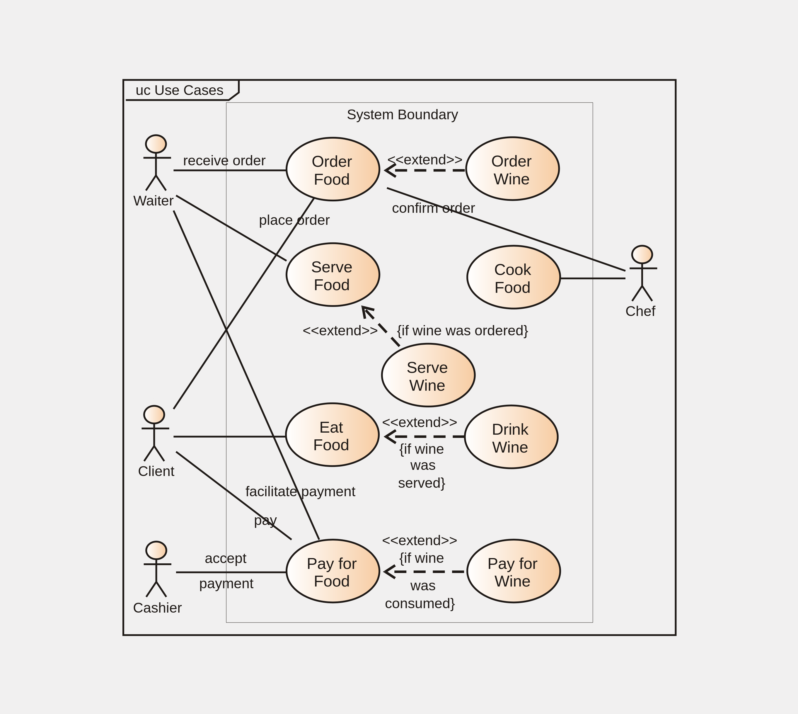

# B端产品需求梳理分析模型

[作者：Leon](https://www.woshipm.com/pmd/582416.html)

> 在B端产品的工作当中，常常要与不同的业务部门打交道，他们的角色众多、诉求各有差异，造就了后台业务产品的复杂性，下面介绍一下我在国内排名第一的房产中介公司工作以来总结的一套产品方法论。

## 需求梳理

我们常常收到来自用户（业务部门）或老板，以一句话高度概括提出的需求：“我需要对挂牌房源进行回访，并进行判定”、“我需要一个对网站400来电录音进行打分的平台”……因此，需要一个框架有序、完整的与用户一起梳理需求十分有必要。

>**需求梳理框架：用户-场景-路径**

### **用户**

在B端产品中，用户即业务部门或前线业务人员的角色。

在面对分工精细的企业内部，我们可以从**“现在是怎样的？”**去入手了解当前的部门架构、岗位分工。

因为所有业务线，无论它现在如何低效或我们看来是多余的，但也是多年来一直优化，被证实有效的才得以保留和运作至今。所以即使新产品基于新流程、新技术，可以节省某些职能角色的参与，也只有从了解现有架构开始，理解现时为何这样配置，每个岗位有何目的和作用，才不至于在产品上线后，才发现一些业务部门隐藏的需求。

这一步，我们的目标是了解有哪些人（角色），会参与到这个产品流程中。

### **场景**

即：在什么场景下，有什么需求，要完成什么目标。把每个角色的场景、需求、目标都一一列出来，然后把需求打碎、重组，即可定义出相关的功能。

这一步可以结合思维导图，采用发散思维方式，与用户一起完全穷尽各种可能发生的情况，再结合业务的考虑，提出对应的解决办法，与用户敲定。

如何穷尽所有可能？这里有个小技巧：**把问题拆解为一个个小问题，对每个小问题追问下去，直至无解、清楚为止。**

> 举个例子：400来电录音检核平台的需求：来电录音采用轮循机制随机分配给AE（Agent Energize，经纪赋能师）检核，以提升经纪人接听来电的服务水准和规范。

数据来源：

1. AE的职位架构取自哪里？K3人事系统？虽然从常识可以知道人事数据来源于人事系统，但刚好本例是特例，由于历史原因，受限于K3系统的限制，“AE”这个的职位数据来源二手业务系统。所以如果新接触一个新角色，特别在历史悠久的公司，最好先与开发沟通，确定数据的来源，甚至如果当前不存在此架构数据，如何进一步处理。
2. 录音来自于哪里？本例中，录音来自于北京总部每天会发送前一条的录音数据文件给我们，我们作为分公司再进一步导入处理。这里涉及到两地技术对接、协商处理。

边界情况：

1. 已分配录音后，AE离职，录音无人检核，是否需要重新分配？
2. 假如离职录音重新分配，录音是否有时效性，比如只分配当月未检核的录音？否则将会影响到报表周期的数据
3. 如果总部没有按照约定，在特定试点发送前一天录音给我们，后备方案怎么处理？
4. ……

以上只是简单举例，实际情况要进行更多的考虑。

### **路径**

即：完成任务所需的流程，用流程把功能串联起来。

这一步推荐使用泳道图，清晰表达角色之间的任务流程，和相互的关联。

如果项目比较复杂，可以用流程图再进一步详细描述各个子流程。

这里稍微提升一下思维高度：**不论何种形式的图表，目的是与业务部门和团队成员沟通，所以选择的图表只要大家看得明白，实现高效沟通即可。**

通过以上三个需求分析框架，我们已经能够清晰与用户沟通，了解用户所需的需求，并通过进一步发掘、整合设想出产品的框架和主要功能。

## 确定系统信息流、相关主体

### **系统信息流**

B端的业务系统，往往需要与很多其他基础服务（OA办公、人事、财务、通讯等）、不同业务系统间的对接。因为这些对接往往决定了新产品的数据来源、实现限制和接口规范，在动手写需求文档之前，不妨先与开发交流一下各关联系统的对接要求，以便可以写出更规范完整的需求文档。当然，一些基础性服务，如果团队间默契已经形成，可以节省这个步骤。

### **相关主体**

在业务上，除了在产品内部的操作，还有很多是线下或对外部系统的操作。如何简单表述出参与者完整的业务活动？这里推荐使用——UML用例图。

用例图有助于讨论和传达以下内容：

1. 您的系统或应用程序与人、组织或外部系统进行交互的几种方案。
2. 它帮助参与者实现的目标。
3. 系统的范围。

> 举个例子。网签预约系统项目：接案专员在网签预约系统（内部产品）收到经纪人的预约案件后，需要在房管局的“存量房预签约系统”进行相关操作，把导出的成交合同上传到网签预约系统（内部产品）以继续后续的确认签约流程。

这个案例涉及几个主体：

1. 经纪人
2. 接案专员
3. 房管局的“存量房预签约系统”
4. 本产品：网签预约系统

使用用例图即可清晰表达划分以上主体及其主要功能（任务），最大好处是以最简洁、高度概括的外部视角与用户（业务部门）沟通确认需求，确保对复杂的业务过程理解一致。

## 项目范围

我把项目范围归纳为三种边界：需求边界、行业边界、系统边界。

### **需求边界**

需求理应没有边界，但如果要实现需求，则存在资源等各种客观原因，使需求有了优先级——即版本规划。我们可以根据B端产品的特性，结合业务的迫切程度，划定优先级的判定标准，如果你的公司习惯项目时间由老板拍板，我这里建议其中一种办法是：在产品初步策划阶段，拓宽思路，尽可能规划完整的产品，向老板、决策者展现完整的目标成果。然后，列出各种功能的建议优先级和所耗资源，提请老板根据时间期限决定实现的优先级，定下此版本的项目范围，即交给老板做减法。

### **行业边界**

如果我们设计的是会计、人力资源等专有行业的系统，我们就不能天马行空，系统的规则离不开行业的法律法规，比如会计就像一个正方形，法律法规已经设好边界，我们所做的是在边界内设计；人力资源的HRBP系统则像一个水桶，半开放式，有其自由性。所以我们设计产品的时候，第一是要深入发掘公司业务的需求，理解业务，通过产品、技术去提升公司效益；第二是熟悉行业相关法律法规，清晰产品的底线要求。为什么自己也要了解？因为业务人员很可能会认为一件在TA看来不言而喻的事情，而你作为行业外的设计者，根本不知道，产生需求盲点，直至产品上线才发现问题。

### **系统边界**

一个产品，只应该为解决一个（类）问题而生。我们最常接触的业务系统，虽然业务多变，形态千变万化，每间公司有其特性，但只有找准主心骨，产品才可以有序健康地发展，我们可以用鱼骨型去比喻它。没有规划的系统，将会越来越变得臃肿难用，或会有一天系统不足以支撑而崩溃。要避免这个问题，有几点心得：

1. **用程序上解耦的思维**，把业务按事件拆分成各自独立的小产品，特别是把共性的基础业务部分独立出来，其他程序需要时其能力时调用接口即可。当一个业务变化时，不会令其他产品受到牵连，灵活性高。
2. **拒绝不合理需求**。虽然B端产品是很多是基于业务部门提出的“需求”，但用户往往习惯以自己的见解提出他们认为合适的解决方案，我们作为专业的产品设计者，应该学会分辨是需求还是解决方案，发觉出用户真正的需求，从全局考虑，整合需求，提出更好的解决方案。
3. **一个产品，只应该为解决一个（类）问题而生。**如果一个产品放到了一个不合适的地方，将会为未来留下隐患。在面对各种各样的需求时，我们应该清晰什么需求应该在什么地方（产品）解决。就像业务系统不应该存放人事数据一样。

## 小结

最后，分享一下在实际工作中，产品上线真正的使用者和需求提出者很可能不是同一个人，需要我们想办法接触到实际操作同事，了解一下他们的想法，考虑到产品中去；需求沟通初步阶段，也很可能没有业务部门的主管（有决策权）或所有干系部门参与，所以当已有初步方案，一定要找所有与产品有干系的业务部门的主管落实方案，达成共识，避免上线后才发现沟通存在问题。

> 图例来自维基百科，作者 Kishorekumar 62，<a href="https://creativecommons.org/licenses/by-sa/3.0" title="Creative Commons Attribution-Share Alike 3.0">CC BY-SA 3.0</a>，<a href="https://commons.wikimedia.org/w/index.php?curid=7880320">链接</a>

---

## 学习笔记

需求梳理的路线是，先定角色，然后确定不同的角色要干什么、他们的目标是什么，打包📦成一个个功能，最后把这些功能串联成业务路径。