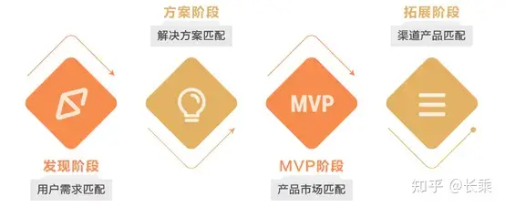
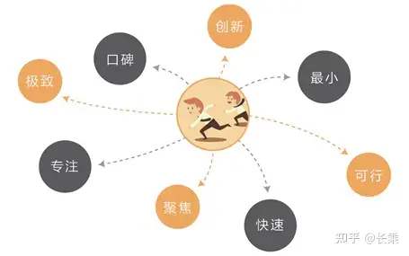
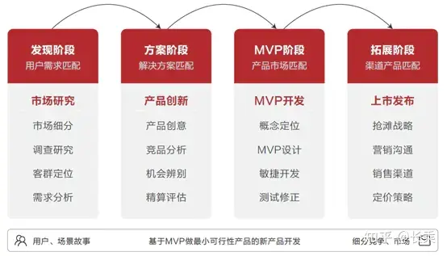

# MVP方法与实践：做最小可行性产品
[@张乐飞](https://zhuanlan.zhihu.com/p/358209336)

最小可行性产品（Minimum Viable Product，MVP）是一种产品思想，它是以极低的成本，最快的速度，向用户交付产品的主要功能及特色。然后，通过及早的接触用户，从而获取客户反馈和市场验证来改进产品，迭代升级，以避免窝在家里做没人要的产品，却自以为很有进度。MVP的应用路径如图1-27所示。

图1-27 做最小可行性产品迭代思维

MVP不是每个迭代做出产品功能的一部分，而是每次迭代都要交付一个可用的最小功能集合，这个集合的功能可以满足用户的基本需求，虽不完善但至少可用。然后逐次迭代做出满足客户预期的产品，直至最后完全满足客户需求。

领导“新产品开发”是产品经理的核心工作职责之一，也是重中之重。在新产品开发过程中，我们首选“做最小可行性产品”（MVP），这在产品会&MVP联盟已经成为一种共识。我们通过5年的实践、讨论、精炼形成了一套完整的MVP思维、MVP理念、MV原则及价值观、以及MVP路线图，为“做最小可行性产品”（MVP）提供了方法论和实践支撑。

### 1.  MVP思维

在MVP落地执行的过程中首先要具有MVP思维，具体体现在新产品开发过程主要阶段：发现阶段（用户需求匹配）、方案阶段（解决方案匹配）、MVP阶段（产品市场匹配）和扩展阶段（渠道产品匹配）四个方面，逻辑结构关系如图1-28所示。

图1-28 新产品开发过程主要阶段及对应思维逻辑

 - **用户需求匹配**：根据市场细分锁定目标用户群体，建立用户画像，挖掘用户真实需求，并通过多维度分析需求度。

- **解决方案匹配**：结合用户需求场景，围绕用户核心诉求提供解决方案，产品创意要与用户需求场景匹配，可落地。

- **产品市场匹配**：根据解决方案开发产品，在产品上市过程中选择抢滩战略，降低试错成本，获取先发优势，以赢得市场竞争。

-  **渠道产品匹配**：根据产品特点优选渠道或根据渠道流量定制产品，做到产品与渠道相匹配，疏通产品交付价值链。

### 2.  MVP理念

有关互联网产品的主流思想（一种做事的方法论），有人将其总结为七个字：专注，极致，口碑，快。我本人非常认同，但这不适用于所有产品，也不能完全的表达做最小可行性产品（MVP）的核心思想。因此，我们在七字诀的基础上，提炼出了“MVP理念”，一共八个关键词，如图1-29所示，用于指导做最小可行性产品（MVP）。

图1-29 做最小可行性产品(MVP)八大理念

- **创新**：深入细分市场，挖掘用户需求，以创新为驱动，为用户提供可感知价值的最优解决方案。
- **最小**：抓住用户核心诉求提供最优解，控制需求范围和项目预算，降低产品创新试错成本。
- **可行**：进行充分的市场调研，在产品开发过程中利用科学的方法工具，增加可行性和成功率。
- **快速**：天下武功唯快不破。调整结构，建立新产品开发战略，快速推陈出新，赢得市场竞争。
- **聚焦**：少即是多，大道至简。聚焦一个领域，一个需求方向进行深挖，打磨产品，做到极致。
- **专注**：专注是单调漫长的，没有足够的耐力，时间、精力和智慧，就无法打磨出极致的产品。
- **极致**：10倍好。不仅满足用户的基础需求，还要满足用户的期望需求，甚至满足兴奋型需求。
- **口碑**：能够让用户感知超出用户预期，让用户兴奋，忍不住的说好，自愿推荐给身边的人。

### 3.  MVP原则及价值观

为了给“做最小可行性产品（MVP）”提供具体行为指导，我们MVP联盟的精英代表经过多次的线上、线下沟通，达成了一些共识。在此我将其总结为12个原则及价值观，用于作为MVP落地执行的行为准则，以增加可行性，提升新产品成功率。

图1-30 做最小可行性产品(MVP)原则及价值观

- **市场要细分**：要研究细分市场，锁定早期用户，并列出早期会采用的客户特征，为用户画像。
- **场景要真实**：用户需求场景要精准、真实，规避主观臆断和片面分析，避免伪需求。
- **需求要痛点**：要了解用户的真实需求，进行需求多维度分析，区分出高频及痛点强需求。
- **方案要可行**：围绕用户核心诉求提供解决方案，产品创意要与用户需求场景匹配，可落地。
- **主张要鲜明**：要具有鲜明的价值主张，如新颖、性能、定制化、品牌/身份地位、价格、效率提升、成本控制、风险控制、可达性、便利性、可用性等，说明产品不同和值得购买的地方。
- **行动要快速**：成立自主型产品项目团队，采用敏捷迭代方法，聚焦结果，对目标负责。
- **渠道要优选**：选择成本最低、路径最短、速度最快的市场渠道将产品价值传导终端给用户。
- **成本要可控**：产品项目制独立核算，要做好成本预算，控制好需求范围及进度，降低试错成本。
- **收支要平衡**：对产品未来3-5年的投入和成本进行精算，为投资决策和风险控制提供财务支撑。
-  **指标可度量**：产品关键绩效指标可用数据化度量，能通过数据分析决策产品迭代和调整市场策略。
- **体验要惊艳**：能够让用户感知超出用户预期，给用户带来惊喜，让用户兴奋，忍不住的说好。
- **竞品要超越**：产品解决方案要做到人无我有，人有我精，不轻易被竞争对手复制或超越。

### 4. MVP路线图

基于MVP思维、理念、原则及价值观做最小可行性产品（新产品开发），我们总结了一条可行的MVP路线图，用于指导MVP实践，如图1-31所示。这也是本书的核心内容及脉络，以此向读者依次讲解做最小可行性产品（MVP）方法与实践。

图1-31 做最小可行性产品(MVP)路线图

- **市场研究**：进行市场调研，选择细分市场，明确用户群体，建立用户画像，分析用户需求，根据需求场景发现产品创意，做到产品创意与需求匹配，首选用户高频、痛点需求。

- **产品创新**：缩小用户需求范围，对用户需求与产品创意匹配度、价值度、可行性进行综合评估筛选，调查竞品并进行SWOT分析，明确产品竞争优势，提炼产品概念，定义产品。

- **MVP开发**：根据产品定位设计开发产品，参照产品类别及属性选择适配的产品开发流程（衍生产品优选精益产品流程，新产品选择敏捷产品流程），快速迭代，推向市场验证。

- **上市发布**：结合产品“抢滩战略”优选渠道及区域进行产品推广，根据市场反馈快速修正，合理产品定价，构建与用户沟通的最佳方式和通道，建立产品品牌认知，加快传播。

本书核心内容将从产品经理负责制的角度，通过“做最小可行性产品”的思想、理念、原则及价值观，将生硬的“专业化”产品管理知识理论、方法、工具贯穿起来，为产品经理提供涉及产品全生命周期管理“耳目一新”的思想理念，“专业实用”的理论方法，“丰富多样”的工具模板，“真实易懂”的场景案例。

内容摘自：人民邮电出版社《独具匠心：做最小可行性产品（MVP）方法与实践》专著，作者：长乘，公众号：MVP-PM

## 案例拆解：B端的MVP产品方法论你懂吗？

[@萧羽](https://www.woshipm.com/pd/2520929.html)

>本文想跟大家谈谈，作为产品人的第一个产品方法论的MVP到底在我们的产品工作中是这么运作，到底应用之后会有什么样的效果？

- 愿景： 作为转行成为产品经理1年的产品人，结合产品方法论，在实践过程中的具体执行情况，希望分享出来，给人以启发。
- 目标人群：产品人&年龄<3岁
- idea：产品论方法的有效性及可行性
- 竞争对手：个人兴趣、时间、惰性

还是老规矩，在每次正式开始写之前，都想唠叨几句，反思前文，开启本文。在上一篇《惰性思维对产品人的伤害》中，着重论证了在产品人的工作过程中，如果没有一套科学的产品方法论，没有自己的产品思考，是很容易陷入泥淖之中，迷失在产品的这条道路上，导致对自己产品道路的怀疑。

那么，在这里，本文想谈谈，作为产品人的第一个产品方法论的MVP到底在我们的产品工作中是这么运作，到底应用之后会有什么样的效果？本文在这里将会结合笔者的实际工作内容，来谈谈MVP的产品方法论，供大家参考与交流。

废话不多说，我们切入正题，本文将从五部分进行描写，分别是：产品背景、产品反面教材、MVP的理论概念、MVP在实际工作中的应用、产品效果。

### 一、产品背景

从笔者之前的文章就知道，当前笔者负责的项目是G端的大数据应用相关的产品，这款产品主要是为了实现对政府部门人员的执法监督、执法规范，但从这个点衍生出来的产品功能范围就特别宽。

- 首先需要识别风险（风险类型包括根据执法流程直接识别风险和数据挖掘分析隐藏的执法风险）；
- 其次是风险识别之后需要进行风险分类核查与处理（不同部门的核查方法和核查的风险数据种类都不同）；
- 再次是针对风险结果数据实现对部门、人员的纪律问责；
- 然后是根据纪律之后的整改情况、风险执法情况等维度对部门、人员进行统一考核考评；
- 最后是根据考核考评的内容实现对部门、人员的奖惩。

当然，笔者只是简要概述了产品的大体背景，不能详尽述说。

### 二、产品反面教材

笔者刚开始接触的客户是牵头负责该产品建设的甲方霸霸，甲方霸霸当时直接为我们梳理了在执法过程中的35个风险点，这让第一次接触这个行业的笔者感激涕零啊，甲方霸霸业没有那么“无理取闹”嘛！然后笔者就开始根据这些风险点，进行建设。

笔者遵循的产品设计优先级的原则是：

1. 客户痛点最痛（1～5分，5分最痛）
2. 数据来源（根据数据易处理性1～5分，5分最容易处理）
3. 开发难度（根据难度系数1～5分，5分最容易）

根据三者相加，计算每个风险点的优先级，按照优先级进行产品设计及开发（笔者这里是15分制，可以根据需求数量，扩展到100分制）。在风风火火启动项目2个月之后，建设完成27个风险点，很高兴地向甲方霸霸汇报项目情况。然后一挥手就开始在个别区县的进行试点使用，不定期的会有不同层级的领导过来视察，兄弟单位业会过来学习。

这试点的过程中，就被严重质疑，这个平台没用！原因是：

1. 数据不全，监督不到位；
2. 风险数据存在大量误报的情况；
3. 服务不到位，只是一种惩罚工具等等各种各样的问题。

这个时候，笔者知道，产品的路径规划完全错了！

### 三、MVP的理论概念

MVP的概念是Eric Ries在其创作的《精益创业》这本书中提出的概念，书中对其解释为“最轻量级的可行性产品（Minimum Viable Product）”，但将这一概念套用在笔者刚开始的产品设计中，笔者的产品规划应该也算是最轻量级的可行性产品啊，对执法流程分阶段实现了执法风险监督。但在试点的时候，却出现这么多的问题，笔者结合B端的产品特征进行分析，B端的主要特征是有工作流。

因此笔者对B端产品的MVP的定义是“**最轻量级的可服务性产品**”。可服务性，是指能够服务与该业务相关的所有参与人员。

### 四、MVP在实际工作中的应用

通过反思，笔者开始对大数据应用相关的产品按照mvp的策略来进行产品设计。

首先选择已建成的某个有特色的亮点、难点的监督领域A的风险（注意：这里不是某一个风险点，是某一类，包含了一个独立的风险种类！另外：如果是0到1的产品，可以在需求池中，通过需求的优先级进行选择），按照MVP的产品建设思路，对目前的产品进行设计完善，整个MVP产品可以通过如下的流程图展示：

通过上述的流程图，我们可以知道，与该类风险相关的部门/人员有3类：责任部门/人员、监督部门/人员、奖惩的部门/人员。

因此根据MVP的思路，上线的产品至少要满足这3类部门/人员的使用和诉求。且功能点需要设计风险识别、风险预警、风险异常、风险推送、风险核查、风险处理、风险整改、风险归档、风险报表统计等功能，这样才能形成一个完整闭环的MVP产品。

而且通过上述的分析，我们也明白这些服务的对象以及需要囊括进MVP的功能，实际上都是由于选定的监督领域A的风险而衍生出来的。但是这也是笔者在进行了前期的产品试错，以及产品试点和深入基层调研反思才明白的一个B端MVP产品设计的道理。

这里总结一下B端的MVP的产品工作方法就是两点：

1. 对客户的业务有一个宏观的了解；
2. 实现最轻量级的产品服务闭环。

### 五、产品效果

1. 迭代更新的产品上线之后，可以针对性的在固定区县，固定部门进行试点，降低系统的推广门槛。
2. 快速验证产品的运转模式，是否贴合业务部门/人员的实际需求。
3. 在给领导汇报、演示的时候，可以实现一类业务的完整闭环，对系统的价值以及系统服务的人群范围有一个直观的了解。
4. 有了基础框架，在后续的产品设计中，很容易进行产品升级迭代，而且整个设计的思维都会是一个闭环的思维。

最后：B端的产品，一定要有产品服务于业务闭环、服务于业务人员、服务于领导的特点。