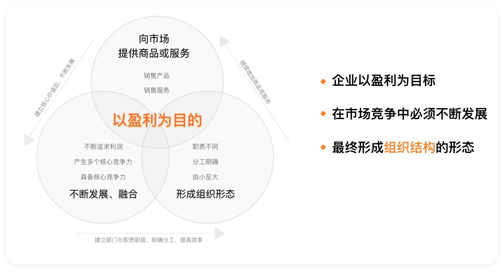
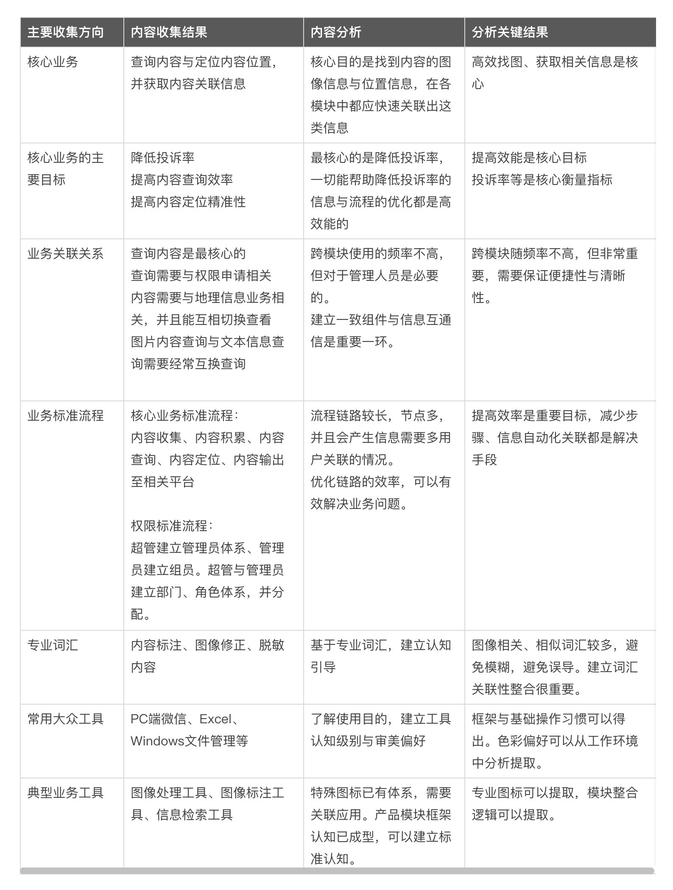

# 万字总结！B端产品设计基础思维与方法

[作者：汤圆](https://www.uisdc.com/b-end-design-method)

本文作者从 2015 年开始进入 B 类产品的打造，前后几年时间进行了行业内容的探索，从概念产品的提出，到产品营收千万以上，从产品 1.0 的两三个功能到后续迭代二三十个功能的平台产品，沉淀了一些个人观点与经验，在此分享出来与大家讨论交流，希望能与大家有更多讨论。

## B 端产品新定义

### 1. B 端产品与工具产品的差异性

> “Word、PPT、PS 等软件算是 B 端产品吗?”

这个问题困扰我很久，以往对 B 端产品的定义大部分是“面向企业提供服务的产品”，但上列的软件，既可以为企业服务，同时也完全可以为个人使用，那么它们算是 B 端产品吗？如果不是，那么什么是 B 端产品？

如果对一个行业没有精准的定位，那么在产品设计过程中，做出预判与差异化是非常困难，于是便开始进行了新定义的思考。

“To B”产品大概从 2016 开始兴起，在此之前大部分服务企业的线上产品被称为“后台”产品，2015 年前后，钉钉等移动办公软件开始火热，行业中开始兴起与“To C”产品对应的“To B”产品类别。至此，为企业提供服务的产品开始称为 B 端产品。但经历了几年发展以后，我们发现这个定义是存在模糊的，有些工具产品既可为个人服务，也可以为企业服务。

B 端界定应该与企业目标与发展趋势相匹配，而我个人认为 To B 产品，更清晰的定义应该是针对“企业”的特性来提取与界定出来，“企业”标准界定是如下描述的：“企业一般是指以盈利为目的，运用各种生产要素（土地、劳动力、资本、技术和企业家才能等），向市场提供商品或服务，实行自主经营、自负盈亏、独立核算的法人或其他社会经济组织。”

其中，目标是以盈利为目的，环境与对象是市场，手段是运用各种要素。

所以我们基于这个目的可以抽离出来，企业是必须要追求盈利的，并且会不断的面临市场竞争，也就需要不断的拓展企业本身的产品或服务体系，以在竞争中站稳，最终这些发展都将带来企业的人数变多、部门变多、职责变多的情况，所以最终会呈现出一个具备清晰组织形态的结果。

我们以是否能支持组织形态，来判断一个产品是否为 ToB 产品，会更加的清晰，例如：Office 套件中，个人使用时，是工具，而购买企业版后，具备了用户数量的分配、权限的分配等功能，那么就是一个 ToB 产品。

△ ToB 产品界定标准分析框架

“具备组织形态”，这个定义的实际作用主要为以下几点：

**能清晰预判 ToB 产品的基础功能**    例如，权限、角色、部门等相关功能都是基础内容，需要提前开始建立，并且尽早考虑组件化、组织化。

**为预判产品业务发展提供基础逻辑**    例如，基于业务与行业状态，核心功能有哪些是必须要做的，哪些是以后很可能需要做的衍生功能，哪些是未来可能合作的第三方功能。

**为建立业务关联性提供预见性**    例如，建立产品框架与功能关联流程时，能预判出哪些业务可能会产生关联，提前建立组件、模态设计形式。

**能为用户研究体系构建分析基础，提供有效的分析结果**    例如，不同职责关注信息不同，决策者看重数据统计，管理者关注权限与数据安全，执行者关注业务问题解决的效率。并且组织形态下，不同部门的用户也对功能有着较大差异的述求。

△ 组织形态示例

#### 设计价值

##### 1. 视觉设计价值

“为什么要投入那么多资源开发数据界面，甚至制作 3D 效果？”

这个话题可以引导出视觉设计在 B 端的核心价值之一，B 类产品中的视觉设计价值，是一个备受讨论的话题：

一方面认为 B 类产品中视觉设计的价值发挥较弱，不能像 C 类产品中一样，可以与运营深度结合，带来流量，同时由于 B 端产品设计内容量较大，使用时偏重效率为主，也较难在情感化设计方面发挥出高价值。而另一方面认为，B 类产品中视觉设计的难度不比 C 类的小，其中设计规范、设计体系、系统化设计方面，由于产品量级的问题，都相对会复杂很多。

而我个人认为，B 端产品的视觉设计价值，核心应该分为两大方面：

**是针对决策输出的内容，目的是引流与体现企业示例，打造光环效应**

例如数据大屏、数字化效果演示模块，这块是吸引决策者的核心内容，可以理解为引流的设计，这方面的设计效果可以直接影响老板的购买决策，潜在体现出 B 类产品供应商企业对产品质量、业务理解、内容设计的能力，能让产品快速产生光环效应，引导老板等决策层产生购买意愿。

**针对执行层输出的内容，目的是降低认知成本，提高使用效率，同时也降低设计研发成本**

例如管理模块、权限体系模块、流程审批与具体任务执行模块等，针对执行层的内容，细分到业务场景中，我们都可以理解为在设计一个工具，而工具强调“清晰、高效”，所以整体视觉的价值在引导用户快速使用方面是具备重要价值的。

再一方面，B 类产品存在的业务模块多、内容量级大的情况，所以视觉设计在组件化、模块化、复用性方面都能降低内部的设计耗时，还有新产品构建时的研发耗时，这也是视觉设计价值的一部分。

总的来说，B 类产品中，视觉设计价值主要在引流与降本两方面，体现在以下三点：

- 引流，即引导决策者对产品产生良好影响；
- 降低认知成本，强化执行层客户的使用效率；
- 降低团队内部设计与研发成本。

##### 2. 交互设计价值

相对而言，B 端产品中的交互设计价值更加直观。

一方面可以明显的为提高用户解决业务问题的效率做出价值；另一方面能预判产品发展，可以为产品避免高成本迭代。

进行长期框架制定上，可以尽力为产品在未来功能大幅增长后，提供依旧可用的框架，并且功能入口认知成本低，且易于寻找，这可以为产品在长期发展中节省大量的迭代成本。一个发展了 2 年以上的 B 端产品，在 2.0 或 3.0 的版本下可能迭代一次需要研发投入 1~3 个月的时间，同时产品需求梳理与设计研究与落地也可能都要投入 1~3 个月，甚至以上。这对产品在与竞品赛跑的过程中是极为不利的，一个适应业务发展的交互框架，可以很好的解决这个问题。

第三方面的价值是对企业内而言的，主要是降本增效。利用中台思维，建立基础控件、业务组件、模块组件等内容，提高产品研发与定制化项目的效率，降低研发成本，提升为其他企业提供服务的效率，可以极好的提高产品的服务满意度。

总结而言，交互设计在 B 类产品的价值在于降本与长期口碑两方面，主要体现以下三个方向：

- 提高客户解决业务问题的效率；
- 降低产品迭代成本，为产品在竞争赛道中赢得有利地位；
- 降低企业内部定制化研发成本，为创新提供更多的时间。

#### 设计难点与解决思路

##### 1. 难点 1 – 用户研究

“C 端用研方法为何在 B 端推进时阻碍重重?”，这也是在 B 类产品设计经常讨论的一个问题。

由于 B 端产品是为企业所提供的服务产品，而企业本身大部分都有其专属的行业特性，并且这些行业差异性非常之大，例如医疗与物流、教育与企业服务，这些行业中的用户本身专业性、生活习惯、社会关系、消费偏好都存在不同。

同时每个行业的专业术语、技术背景也不同，还存在着信息需要保密等状况，对做用户研究带来了巨大阻碍。那么从什么角度来做 B 端用户研究会更加快速准确？这里分享我们常用的方式，总的方向倾向使用定性类的测试与现象观察分析类的思维。

C 类产品受众大部分是具备同质性的，而大部分 C 类产品的策略也是优先吸引同类人群。虽然他们不同地点、不同年龄，但有明显共同喜好、习惯或述求。而 B 类场景中，我们经常可以看到白发管理者与刚毕业的年轻人在交流。企业中的客户，除了同在一个企业共事是明显的共性外，年龄、习惯、消费水平基本都存在差异性，我们从观察法的角度来尝试进行 B 端用户的特性研究。

其中主要是从本能与习惯两个维度来分析，进而得出用户习惯与偏好，具体思路如下：

对习惯的研究，我们可以称为“认知惯性”的研究，大部分人在一个陌生环境中，面临选择时，通常倾向选择与日常生活环境相似的色彩、相似的行为顺序、相似的语言语调。这是人类本能中的一个倾向，很多情况下，我们会选择更具备安全感的方向，通常熟悉的内容与环境能为我们提供较为安全的感觉。

我们以一个比较典型的案例来看，在政企行业的会议中，座位的等级是非常清晰明确的，并且流程极其规范。所以在很多政企类产品中，流程化、标准化是必要的，然后再追求高效。

并且这类人群对信息的正确性与安全性是非常看重的，在安全与效率中，遵循的基本准则是安全、符合标准是第一位，此时设计产品时，体验关注点在于如何构建一个安全的体系与标准流程，完成后再去追求高效便捷的易用性指标。

如果违背了安全标准的规则，一味的以 C 类产品的体验视角去推动，是容易受阻的。而在满足安全标准的条件下，再去追求高效便捷，甚至情感化，是更好的一个产品迭代顺序，也更利于产品被客户所接受并营造更好的服务口碑。

在 B 类产品中，每个行业看重的指标非常不同。每个行业都应该要先建立指标体系与指标优先级，再进行产品设计规划与迭代会更加容易。

例如 G 端（服务政府产品）类的，一定要先遵循安全标准，再追求易用性。而在智能硬件行业中，管理平台更追求高效便捷，安全问题也很重要，但由于安全相关问题不多，所以会将效率指标放的更高。那么如何研究行业的业务特征，并且制定量化指标与系统化思维也是 B 类产品的重要问题，这是 B 类产品的第二个难点 – 研究业务，接下来我们就来探讨一下业务研究的方法。

##### 2. 难点 2 – 业务研究方法

“这个行业的典型特性是什么？”，相信这个问题在每一个 B 类系统的设计师与产品经理面前都会呈现出来。前面提到 B 类产品一个很重要的目标是为系统提升效率而服务，而这个提升效率的对象是什么，需要有清晰的界定。

大部分 B 类产品解决的问题，都是企业中的老问题、老流程，通过数字化的形式，提高以往线下沟通、对接、制作、审批等环节的效率问题，以提高解决业务问题的效率，降低人力成本，甚至解决了以前人力投入量太大而导致无法解决的问题。

了解业务场景与核心内容，有以下两种核心方式：

**收集以往在线下解决问题的路径与方式**

进行书面类文档、人与人沟通节点与交付内容的梳理，输出核心目标、关键节点、整体流程、呈现形式四种内容。

**收集以往使用的平台系统与专业工具**

由于我们针对的行业大部分已经存在几十年甚至上百年，所以他们也具备了一些旧的线上系统与对应的专业工具，深入研究这些工具的构架、流程、核心界面元素是非常有效的方式，研究完成后，需要输出业务平台与专业工具的框架布局、常见流程、特色功能、必备功能等内容。

通过这两种方向的内容收集与分析，可以帮助大家梳理出以下一些主要内容：

- 业务核心目标
- 业务标准流程
- 业务关联关系
- 专业词汇
- 以往操作习惯
- 工具认知级别

我们以表格的形式进行梳理，会更加直观地得出结果，给出一个大致的示例：

在了解业务后，通常就是对以往业务的流程、产品进行优化，以达到提升效率的目的。同时，为了验证优化的结果是有明显作用的，也就要求建立出具体的量化指标，接下来我们看如何基于业务建立量化指标体系。

建立量化指标的方法：通过业务研究了解了关键发力方向后，需要对优化效果进行量化指标建立。对于量化指标，可以分为内、外两个方向。内，指的是对产品本身而言，这个方面中，衡量效率与认知成本是核心的指标。

由于 B 类产品邀请客户参与实际测试的机会较少、门槛也较高，也由于大部分数据隐私问题无法采用埋点的形式收集数据。

所以在与客户实际沟通前，进行一轮效率测试是困难，但却必须的。针对效率计算方式我们先拆解出一个与用户剥离的方式，直接通过计算步骤、使用频率、功能使用者的决策影响力这三个要素进行测算，可以使用以下公式：

效率优先级 = 步骤 x 功能使用频率 x 用户数量 x 使用成员的决策影响力

但对于使用效率而言，单独计算步骤本身不能代表实际的使用效率。

虽然有了这部分效率计算维度，但最终必须要实际用户配合测试才能得出有效结果，这个结果的目的是测试易用性相关内容，例如错误率、易学性、有效性等等，基本逻辑是与定性测试相同。

由于实测用户的机会宝贵，并且还有 B 类用户真实的实操者可能对业务述求不同，习惯也不同，所以基于他们的测试结果或者收集的建议会有很大偏差。为了保证测试结果的有效性，可以邀请行业中的三种特性人群进行测试，可以得出更好更全面的测试结果。

**业务专家**

他们对业务精通，如果行业内有相关比赛，尽量邀请排名靠前的专家，他们可以提供前瞻性的建议，并且可以提供提高业务效率的具体思路，对行业中的人群认知也能提供基础信息。

**日常业务执行者**

他们每日都会进行日常的业务处理，可以提供对业务的惯性理解与认知习惯。

**老板与管理层人员**

他们很多是产品或定制化产品的审核者，他们平时不经常执行业务，所以对业务的具体建议可能会有所误导，这点需要注意。但他们对产品未来规划，还有与竞品的对比情况非常清晰，可以很好地反馈出目前设计的水准。

最后，再基于三种不同角色的用户去建立细化的量化指标，即可完成，例如：

**日常业务执行者**

关注效率，指标为效率与认知，得出的结果是数据测试的结果。

**管理层人员**

关注结果与规划，指标与认知相关、数据密度相关，有条件也可以加入净推荐值（NPS）的指标。针对管理层，得出的更多是定性指标，结果是分数。

**业务专家**

关注效率，并能提供创新性的思维与指导。指标为效率与认知，最好再加入定性维度，与竞品做对比分析，得出的结果是数据内容与分数。

在了解完整体业务，并建立了初步的指标后，通常需要思考产品框架如何搭建、功能如何组合的问题，目的是希望能搭建一个不错的框架，让产品后面避免框架方面的大修改，降低团队的研发成本，同时也能更好的应对多功能集成述求，同时保证产品体验与效果不降低。为解决这个问题，我们可以使用“系统化思维”。

应用系统化思维，搭建稳定包容的产品框架。“这个产品功能非常多，能不改就不要改”，类似情况在 B 类产品迭代中时经常见到的。B 类产品的迭代逻辑，大多都是由单一功能价值服务到平台价值服务发展的。这与 B 类产品制造企业，从小规模起家到大规模后具备客户群体基础，有非常强的关联。

B 类产品随着企业的发展与增长，需要不停的添加新功能，为制造 B 类产品的企业寻找新的发展方向，以抵御市场竞争，构建出有力的壁垒。

由此，B 类产品在较长时间内都会不停的增加新功能，并且会经常出现三种常见情况：

- 集成其他产品的功能；
- 提供接口被其他产品集成；
- 为大型客户提供定制化产品，自己打造一个基础产品的标准平台。

这三种情况都意味着产品会与其他企业密切合作，并且自身也需要不停地增加功能。

大部分 B 类产品的主功能有 3 或 4 个，衍生功能有 10 多个，甚至 20 多个。而发展 2~3 年后的 B 类产品，迭代成本异常高昂，产品内部保证一致性也非常不容易，后期还需要集成其他企业的功能，为客户提供一致的体验。

为了解决这一问题，中台、组件等思维都开始应用兴起，它们都是为了解决功能太多、管理不易、调整太慢的问题。

而解决业务发展与内容调整效率的问题，主要也有三种思路：

- 全面了解业务情况，构建高包容性产品框架；
- 建立高通用性的基础控件与组件，还有高频操作框架的认知（例如确认与关闭按钮的位置等），给集成产品提供规范与标准，同时能快速对组件、色彩进行统一调整；
- 建立常用业务组件，并深入优化业务组件性能与易用性，快速搭建定制化产品。

B 类产品的框架搭建，可以从 OS 系统的迭代逻辑中吸取很好的经验。OS 系统也面临需要建立用户习惯认知，并且大量接纳各类 APP 或软件制作商来制作各行业的软件，同时要保证产品的一致性。

OS 系统从 Windows98 开始，已经迭代了 20 多年，建立起了非常不错的框架与接口逻辑，并且 OS 也是以提供基础功能为主，例如我们常用的大部分是文件夹、Doc 栏一系列其他的文本编辑、绘图等功能，经常使用第三方企业提供的软件。

我们可以以下图来对比 OS 与 B 类产品的发展情况：

#### 设计创新方向

##### 1. 视觉设计创新

B 端视觉设计创新是一个新兴探索的方向，因为大部分产品都追求简洁高效，所以大部分人认为视觉难以发力，创新也较难。但其实在 B 类行业中，视觉创新是非常重要的一个部分，并且对核心决策者的决策影响非常大。

视觉创新有三个方向：

**在数据可视化方向的创新**

这方面的创新都是针对核心决策者的创新，目的是让产品的实际价值更加直观，通常以数据可视化的形式呈现，并且也体现出 B 类企业的产品研发设计水平，让购买者放心，同时营造出光环效应。

**在具体业务内容方向的创新**

针对 B 类产品业务特性非常多，所以基于业务也需要优化的视觉内容，例如图片展示样式、大小。

同时核心业务中的重点元素视觉优化对提高产品使用效率有直接价值的，这个方向在工具产品中较为常见，例如 Teambition 采用的卡片任务与甘特图形式关联的方式，相对以往多个工具切换，要直观方便很多。

**在核心业务的重点元素上创新**

基于核心业务后，还需要再进行细分，针对核心的组件进行创新，目的也在于提高解决业务问题的效率，通常通过降低认知负担或提高操作便捷性、信息阅读便捷性来达成。

依旧以 Teambition 为案例，在任务分配的场景下，进行了任务卡片的创新，而这个创新来源于对任务责任人的表达形式、任务到期提醒信息的信息阅读便捷性进行了创新。

##### 2. 交互设计创新

交互方向的创新，是围绕着对团队内部的研发设计效率、对客户的业务问题效率两方面进行的，大致有三个方向：

**基于框架发展的创新**

这个创新的难度最大，需要对业务有深入的了解，能对行业发展与业务述求的发展有准确的预判性（这个预判最好的来源是前面提到的专家与决策者用户），基于准确的预判，在深入了解业务上下游产品的述求与功能聚合性后，才能建立起来一个稳定的、具备包容性且清晰的框架。

例如，钉钉在基于微信左中右结构下，进行了更多内容集合、工作工具的框架创新。为了建立更强的扩展性，在“工作”中采用了 web 的标签形式，便于进行多功能切换操作。

**基于核心业务的组件创新**

具体是从现有产品中，抽离出具备共性的内容，这些组件是要在业务流程中处于核心环节的高频组件，组件的优化对产品解决业务操作效率有明显的价值，这样的组件投入资源进行创新才具备核心价值与竞争力。

依旧以钉钉为例，待办事项是工作中常用的一种提醒工具，对待办事项组件的建立、查看与提醒流程的组件搭建，既可以有效解决办公效率问题，也可以减少产研团队设计开发的成本。

**同样是对核心业务的元素进行创新**

这个创新主要是围绕提高效率进行的创新，通常需要先找到核心业务中最高频的交互元素，然后进行交互形式、交互动效、内容操作形式的创新。这个方向在公开的产品中较少见到精准有效的创新，我们以国外的邮箱工具 Spark 为例，在日常工作中，邮件沟通都是较为正式且重要的内容。但由于每个人的事务较多，有时在概览完邮件信息后，希望稍晚处理，所以需要做稍后处理的标记，SparkMail 的基于这个高频行为，在移动端与 PC 端都进行快捷的交互优化，移动端采用右滑标记，Mac 端采用右滑或右键标记的方式。

##### 3. 技术效果创新

技术效果创新，同样也是围绕产品价值体现的，其中核心创新为两个方向：一个是针对决策者的效果创新，另一个是针对实际产品效率的创新。

**针对决策者的创新 -Web3D 与智慧大屏效果创新**

这类创新需要与视觉设计密切合作，视觉效果与数据信息的呈现是重点。现在通常使用的有两种基础技术，一种是与 web 平台直接结合的 3D 效果，这类大部分使用 Threejs 的逻辑进行显示，具体案例可以在 ThreeJS 官网进行查看。

基于这类技术，国内也推出了更简洁化的服务，例如 ThingJS，这类网站大家只需拖动模型就可以做出效果，开发也比较便于使用，但效果大部分只能做到中等水准，对电脑的性能消耗也较大。

**前端效果创新 – 针对的实际使用者**

由于 B 类产品中，产品要解决大量的认知问题与效率问题，前端效果的创新同样也是围绕这两个维度进行的。表层效果的技术创新，以降低用户认知为目标，提高用户使用效率，例如一些图片相关产品中，图片剪裁、拖动、放大等效果的创新。

还有一些是为产品加载速度创新，例如大量的列表、树结构等，这类控件的加载速度非常影响用户解决业务问题，而进行越多的创新就越好。这方面作者也不是内行，只将通常关注的网站发出来与大家分享。

AntDesign 团队的一些新内容发布，网址如下：

- 组件内容： [https://ant.design/docs/react/introduce-cn](https://link.uisdc.com/?redirect=https%3A%2F%2Fant.design%2Fdocs%2Freact%2Fintroduce-cn)
- 图表内容： [https://antv.vision/zh](https://link.uisdc.com/?redirect=https%3A%2F%2Fantv.vision%2Fzh)